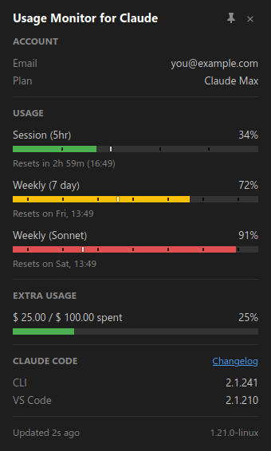

# Usage Monitor for Claude (Linux)

**Monitor your Claude rate limits in real time - right from your Linux system tray.**

A Linux port of [Usage Monitor for Claude](https://github.com/jens-duttke/usage-monitor-for-claude) by [Jens Duttke](https://github.com/jens-duttke). A GTK tray app that shows your Claude usage at a glance - lightweight, pure Python, and fully auditable. Rate limits are shared across claude.ai, Claude Code, Claude Code Cowork, and IDE extensions for VS Code and JetBrains - always know how much of your session and weekly limits (Sonnet, Opus, Fable, Cowork, and any future quota types) you have left.



## Quick start

1. Download the `.deb` from [Releases](https://github.com/jorgealonsodev/usage-monitor-for-claude-linux/releases) and install it:

   ```bash
   sudo apt install ./usage-monitor-for-claude_<version>_all.deb
   ```

2. Run it (or find **Usage Monitor for Claude** in your application launcher):

   ```bash
   usage-monitor-for-claude
   ```

3. A tray icon appears with your live usage. That's it - it authenticates through your existing [Claude Code](https://docs.anthropic.com/en/docs/claude-code) login, no API key needed.

Not on a Debian-family distro, or no sudo? See [Installation](#installation) for the `tar.gz` user-level installer and running from source. Tray icon missing? See [Tray icon not visible?](#tray-icon-not-visible)

## Features

- **Zero configuration** - authenticates through your existing Claude Code login
- **Live tray icon** - two [configurable usage bars](docs/configuration.md#tray-icon-bars) or [stacked percentages](docs/configuration.md#tray-icon-bars), theme-aware for light and dark panels, with optional [color levels by usage](docs/configuration.md#tray-icon-color-levels) (traffic-light style)
- **Detail popup** - account info, reset countdowns, extra usage, and a bar for [every active quota type](docs/configuration.md#popup-fields); drag it by its header (the position is remembered), pin it open, or trim it to a [compact view](docs/configuration.md#compact-pinned-view); optional [bar color levels](docs/configuration.md#popup-bar-color-levels)
- **Claude Code versions** - shows the installed version per environment (CLI, VS Code, Cursor, Windsurf, [remote installs](docs/configuration.md#claude-cli-command))
- **Smart alerts** - [per-quota thresholds](docs/configuration.md#alert-thresholds), time-aware mode, reset notifications, and absolute-spend alerts for extra usage
- **[Event commands](docs/event-commands.md)** - run any shell command on quota reset, threshold crossing, startup, or on demand from the tray menu
- **Time marker** on every bar - see whether usage is ahead of or behind the clock; bars that outpace it turn red
- **Automatic token refresh** - renews the OAuth token via `claude update` in the background
- **Adaptive polling** - faster during active usage, paused when idle or locked, aligned to quota resets
- **Multi-account** - one instance per account via `--config-dir="<path>"`, each with its own tray icon and settings
- **13 languages** - auto-detected from your system locale
- **[Customizable](docs/configuration.md)** - polling, colors, thresholds, fields, and more via one optional JSON file

## What is different from the Windows original?

The AppIndicator tray protocol has no click events, so the interaction model differs slightly:

- **Left-click opens the menu** (there is no click-to-open). **Show Claude Usage** is the first menu entry and also the **middle-click** (secondary activate) action.
- **There is no double-click gesture.** When `on_double_click_command` is configured, it appears as a dedicated menu entry instead.
- The popup closes when it loses focus (click anywhere else) or on **Escape**, unless pinned. It opens in the work-area corner nearest the pointer - or at the position you last dragged it to.
- The popup can be dragged by holding its header bar without pinning it first (upstream gates dragging behind the pin).

Everything else - settings keys, popup, alerts, event commands, languages - behaves exactly like the upstream app.

---

## Security & Transparency

This tool handles your Claude Code OAuth token, so you should be able to verify it is safe. The codebase is deliberately structured for easy auditing:

- **Single network destination** - communicates exclusively with `api.anthropic.com`, no other hosts
- **Credentials stay local** - the OAuth token is used only in HTTP Authorization headers, never logged, stored elsewhere, or transmitted to third parties. The credentials file is read-only for this app - it is never written
- **Minimal, transparent file writes** - the app writes only:
  - a single-instance lock file (`usage-monitor-for-claude*.lock`) in `$XDG_RUNTIME_DIR` (or `/tmp`)
  - transient tray icon PNGs in a private directory under `$XDG_RUNTIME_DIR` (or `~/.cache`), deleted as they are replaced and removed on exit
  - an XDG autostart entry (`~/.config/autostart/usage-monitor-for-claude*.desktop`) - only if autostart is enabled, removed when disabled
  - a UI state file (`~/.config/usage-monitor-for-claude/state*.json`) holding only the screen coordinates the popup was last dragged to - written only when you drag the popup

  An expired OAuth token additionally triggers `claude update`, which may install a newer Claude Code version. Nothing else on your system is modified
- **No dynamic code execution** - no `eval()`, `exec()`, `compile()`, or dynamic imports
- **No obfuscation** - no encoded strings, no hidden URLs, no minified logic
- **Modular architecture** - small, focused modules with security-critical code (credentials, API calls) isolated in a single file ([`api.py`](usage_monitor_for_claude/api.py))
- **System dependencies only** - no bundled interpreter, no pip packages: [PyGObject](https://pygobject.gnome.org/) (GTK 3, WebKit2GTK, AyatanaAppIndicator3, libnotify), [requests](https://pypi.org/project/requests/), and [Pillow](https://pypi.org/project/pillow/), all installed from your distribution's repositories

---

## Requirements

- **Linux** with a system tray that supports AppIndicator/StatusNotifier icons. Developed and tested on Debian/Ubuntu-family distributions (Debian, Ubuntu, Linux Mint); other distributions work if the GTK 3 / WebKit2GTK 4.1 / AyatanaAppIndicator3 stack is available
- **X11 recommended.** On Wayland the app runs, but idle detection degrades gracefully to "never idle" (polling does not pause on inactivity; lock detection via logind still works) and popup positioning may be limited by the compositor
- **[Claude Code](https://docs.anthropic.com/en/docs/claude-code)** installed and logged in (CLI or IDE extension - any variant works). The app reads the OAuth token that Claude Code stores locally (`~/.claude/.credentials.json`), or from `CLAUDE_CONFIG_DIR` when that is set; the `--config-dir="<path>"` command-line parameter overrides both. To run one instance per Claude account, log each account in via Claude Code with `CLAUDE_CONFIG_DIR` pointing at its own directory first

> [!TIP]
> If the token expires, the app automatically runs `claude update` to refresh it. If the token is missing entirely, the app shows a notification and a "!" icon - log in to Claude Code and the monitor picks it up automatically.

---

## Installation

### Option 1: `.deb` package (Debian, Ubuntu, Mint)

```bash
sudo apt install ./usage-monitor-for-claude_<version>_all.deb
```

`apt` pulls all runtime dependencies automatically (`python3-gi`, `gir1.2-gtk-3.0`, `gir1.2-webkit2-4.1`, `gir1.2-ayatanaappindicator3-0.1`, `gir1.2-notify-0.7`, `python3-requests`, `python3-pil`, `libxss1`, `fonts-dejavu-core`). Uninstall with `sudo apt remove usage-monitor-for-claude`.

### Option 2: tar.gz (user-level, no sudo)

```bash
tar -xzf usage-monitor-for-claude-<version>-linux.tar.gz
cd usage-monitor-for-claude-<version>
./install.sh
```

Installs into `~/.local` (override with `PREFIX=/some/prefix ./install.sh`). The installer checks for the required system packages and prints the `apt` command to install any that are missing. Remove with `./uninstall.sh`.

### Option 3: from source

```bash
git clone https://github.com/jorgealonsodev/usage-monitor-for-claude-linux.git
cd usage-monitor-for-claude-linux
/usr/bin/python3 -m usage_monitor_for_claude
```

No `pip install` needed or wanted - all runtime dependencies are system packages (PyGObject cannot be reliably installed from PyPI). Use a `python3` that can import `gi`; on Debian-family systems that is `/usr/bin/python3`.

### Run

```bash
usage-monitor-for-claude
```

Optional flags: `--config-dir="<path>"` (monitor a specific Claude config directory) and `--verbose` (print startup and polling diagnostics to the terminal).

---

## How to Use

| Action | What happens |
|---|---|
| **Left-click** the tray icon | Opens the menu - **Show Claude Usage** is the first entry |
| **Middle-click** the tray icon | Opens the detail popup directly (same as **Show Claude Usage**) |
| **Hold + drag** the popup header | Moves the popup anywhere - the position is remembered for the next open |
| **Menu → Double-click** | Runs the [`on_double_click_command`](docs/event-commands.md) - the entry only appears when the command is configured |
| **Other menu entries** | Test event commands, restart, GitHub link, quit |
| **Escape** or click elsewhere | Closes the detail popup (unless pinned) |

### Tray icon not visible?

- Make sure the AppIndicator GObject introspection package is installed (`gir1.2-ayatanaappindicator3-0.1` - the `.deb` installs it automatically).
- **GNOME** does not show AppIndicator icons out of the box - install and enable the [AppIndicator and KStatusNotifierItem Support](https://extensions.gnome.org/extension/615/appindicator-support/) extension (package `gnome-shell-extension-appindicator` on Debian/Ubuntu).
- KDE Plasma, XFCE, MATE, Cinnamon, and LXQt support AppIndicator icons natively.

### Reading the progress bars

Each bar in the detail popup has up to four visual elements:

1. **Blue fill** - how much of the limit you have used
2. **Time dividers** - subtle gaps splitting the session bar into equal hour sections and marking local midnights on the weekly bars
3. **White vertical line** - how much *time* has passed in the current period. The fill turns **red** when it passes this marker, warning that you may hit the limit before the period resets.
4. **Reset text** - when the limit resets, shown as a countdown with clock time

---

## Configuration

All settings work out of the box - no configuration file is needed. To customize behavior, create a file called `usage-monitor-settings.json` with only the keys you want to change:

```json
{
  "poll_interval": 180,
  "bar_fg": "#00cc66",
  "bar_fg_warn": "#ff6600"
}
```

The app searches for this file in these locations (first match wins):

1. **`$CLAUDE_CONFIG_DIR/usage-monitor-settings.json`** (only when a custom config directory is set via `--config-dir` or `CLAUDE_CONFIG_DIR`) - so each instance can have its own settings
2. **The application root** (the install directory, or the project root when running from source)
3. **`~/.config/usage-monitor-for-claude/usage-monitor-settings.json`** (respects `$XDG_CONFIG_HOME`)
4. **`~/.claude/usage-monitor-settings.json`**

The app never creates or modifies this file. See [Configuration](docs/configuration.md) for all available settings (alert thresholds, polling intervals, colors, language, and more).

---

## Building the Packages

<details>
<summary>For developers who want to build the .deb and tar.gz themselves</summary>

### Prerequisites

- The runtime dependencies (see [Installation](#installation))
- `dpkg-deb` (part of `dpkg`, preinstalled on Debian-family systems)
- Optional: `desktop-file-validate` and `lintian` for extra build-time checks

### Build

```bash
bash build.sh
```

Produces both artifacts in `dist/`:

- `dist/usage-monitor-for-claude_<version>_all.deb`
- `dist/usage-monitor-for-claude-<version>-linux.tar.gz`

The version is read at build time from `__version__` in [`usage_monitor_for_claude/__init__.py`](usage_monitor_for_claude/__init__.py) - it is never hardcoded in packaging files.

</details>

---

## Development

<details>
<summary>For developers who want to work on the code</summary>

### Run from source

```bash
/usr/bin/python3 -m usage_monitor_for_claude --verbose
```

Use the system Python - pyenv/conda interpreters usually lack the `gi` bindings. The installed launcher handles this automatically by probing `/usr/bin/python3` first.

### Run the tests

```bash
/usr/bin/python3 -m unittest discover -s tests
```

### Popup UI development

The popup UI lives in [`usage_monitor_for_claude/popup/`](usage_monitor_for_claude/popup/) as separate HTML, CSS, and JS files (from the Windows original; the Linux port removes the pin requirement for header dragging). To preview and iterate on the UI without running the full app:

```bash
python3 -m http.server 8080
```

Then open <http://localhost:8080/usage_monitor_for_claude/popup/dev.html> in your browser. Use the buttons to switch between data presets (full, minimal, error, loading) and the language dropdown to preview every locale, which is how you spot strings that overflow the popup width.

### Troubleshooting

- **Tray icon missing** - see [Tray icon not visible?](#tray-icon-not-visible) above.
- **`ModuleNotFoundError: No module named 'gi'`** - you are running a pyenv/conda/venv Python. Run with `/usr/bin/python3`, or use the installed `usage-monitor-for-claude` launcher, which picks a `gi`-capable interpreter automatically.
- **Nothing seems to happen** - run with `--verbose` to see startup diagnostics and polling activity in the terminal.

### Publish a release

Work through this checklist in order - each step gates the next:

- [ ] Update `__version__` in [`usage_monitor_for_claude/__init__.py`](usage_monitor_for_claude/__init__.py) - packaging reads the version from there at build time
- [ ] Update `_FALLBACK_USER_AGENT` in [`usage_monitor_for_claude/api.py`](usage_monitor_for_claude/api.py) to the current Claude Code version
- [ ] Add a `## [x.y.z] - YYYY-MM-DD` section to [`CHANGELOG.md`](CHANGELOG.md)
- [ ] Full test suite green: `/usr/bin/python3 -m unittest discover -s tests`
- [ ] Smoke test from source: `/usr/bin/python3 -m usage_monitor_for_claude` - tray icon, popup, and settings work
- [ ] Build: `bash build.sh` - both artifacts appear in `dist/`
- [ ] Smoke test the `.deb`: install it and verify tray icon, popup, and settings
- [ ] Commit and push (`main`), then tag - CI does the rest:

  ```bash
  git tag v<version> && git push origin v<version>
  ```

  The [Release workflow](.github/workflows/release.yml) runs the tests, builds both packages, checks the tag against `__version__`, and publishes the release with install-table notes. Linux artifacts only - Windows users are pointed to the [upstream releases](https://github.com/jens-duttke/usage-monitor-for-claude/releases). To publish manually instead: `gh release create v<version> dist/*.deb dist/*.tar.gz --title "v<version>" --notes-file <notes.md>`.

</details>

---

## Credits & License

MIT - see [LICENSE](LICENSE).

- Original Windows application by [Jens Duttke](https://github.com/jens-duttke): [usage-monitor-for-claude](https://github.com/jens-duttke/usage-monitor-for-claude)
- Linux port maintained by [J. Alonso](https://github.com/jorgealonsodev)

Bug reports and pull requests for the Linux port are welcome at [jorgealonsodev/usage-monitor-for-claude-linux](https://github.com/jorgealonsodev/usage-monitor-for-claude-linux/issues). For feature ideas that apply to the app itself (not the port), consider the upstream project's [Ideas](https://github.com/jens-duttke/usage-monitor-for-claude/discussions/categories/ideas) discussions so both platforms benefit.

---

## Disclaimer

This is an independent, community-built project. It is **not** created, endorsed, or officially supported by [Anthropic](https://www.anthropic.com/). "Claude" and "Anthropic" are trademarks of Anthropic, PBC. Use of these names is solely for descriptive purposes to indicate compatibility.
